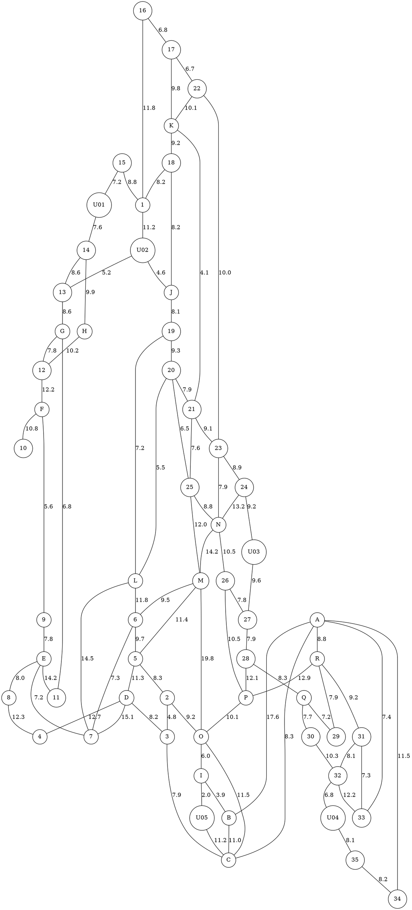

# 任务

本文档用于记录本项目需要实现的原始任务，并非详细的执行计划。

---

说明：原图中少数道路分段/交汇点没有标出名称，在后续算法中将**不要求必须经过这些点**；为保留图中每个路段旁的权重，已将这些未命名点记为 `U01`–`U05`。`I` 为大写字母 I，不是数字 1。

```tsv
source	target	weight
15	U01	7.2
U01	14	7.6
15	1	8.8
16	17	6.8
16	1	11.8
17	22	6.7
17	K	9.8
22	K	10.1
22	23	10.0
K	18	9.2
K	21	4.1
18	1	8.2
18	J	8.2
J	19	8.1
1	U02	11.2
U02	J	4.6
U02	13	5.2
14	H	9.9
14	13	8.6
13	G	8.6
H	12	10.2
G	12	7.8
G	11	6.8
12	F	12.2
F	10	10.8
F	9	5.6
9	E	7.8
E	8	8.0
E	7	7.2
E	11	14.2
19	20	9.3
19	L	7.2
20	L	5.5
20	25	6.5
20	21	7.9
21	23	9.1
21	25	7.6
23	24	8.9
23	N	7.9
24	N	13.2
24	U03	9.2
U03	27	9.6
25	N	8.8
25	M	12.0
N	26	10.5
N	M	14.2
26	27	7.8
26	P	10.5
27	28	7.9
28	Q	8.3
28	P	12.1
P	O	10.1
M	O	19.8
M	6	9.5
M	5	11.4
L	6	11.8
L	7	14.5
6	7	7.3
6	5	9.7
5	D	11.3
5	2	8.3
D	7	15.1
D	3	8.2
D	4	12.7
8	4	12.3
2	3	4.8
2	O	9.2
3	C	7.9
O	C	11.5
O	I	6.0
I	U05	2.0
U05	C	11.2
I	B	3.9
B	C	11.0
A	B	17.6
A	C	8.3
A	R	8.8
A	33	7.4
A	34	11.5
R	P	12.9
R	29	7.9
R	31	9.2
Q	29	7.2
Q	30	7.7
30	32	10.3
32	U04	6.8
U04	35	8.1
31	32	8.1
31	33	7.3
32	33	12.2
35	34	8.2
```



上述两个代码块（本质上一致），记录的是某县的乡（镇）、村公路网示意图，权重表示该路段的千米数，其中**大写字母节点`A-R`代表乡（镇）**，**数字节点`1-35`代表村，`U01–U05` 为人工添加的辅助道路节点，不代表乡（镇）或村，不计入必须巡视点，也不产生停留时间。**


某年夏天该县遭受水灾，为考察灾情、组织自救，县领导决定带领有关部门负责人到全县各乡（镇）、村巡视。巡视路线从县政府所在地（节点O）出发，走遍各乡（镇）、村，再回到县政府所在地（节点O）。

​	(1) 若分3组（路）巡视，试设计总路程最短且各组尽可能均衡的巡视路线。

​	(2) 假定巡视人员在各乡（镇）停留时间$T=2h$，在各村停留时间$t=1h$，汽车行驶速度$v=35km/h$，要在$24h$内完成巡视，至少应该分成几组（路）？给出这种分组下你认为最佳的巡视路线。

​	(3) 在上述关于$T,t,v$的假定下，如果巡视人员足够多，则完成巡视的最短时间是多少？在这种最短时间完成巡视的要求下，给出你认为最佳的巡视路线。

​	(4) 若巡视组数已定（比如3组），要求尽快完成巡视，讨论$T,t,v$的改变对最佳巡视路线的影响。
