# 任务

本文档用于记录本项目需要实现的原始任务，并非详细的执行计划。

---

说明：原图中少数道路分段/交汇点没有标出名称，在后续算法中将**不要求必须经过这些点**；为保留图中每个路段旁的权重，已将这些未命名点记为 `U1`–`U6`。`I` 为大写字母 I，不是数字 1；数字村节点 `1` 与字母节点 `I` 是两个不同节点。

```tsv
source	target	weight
15	U1	7.2
U1	14	7.6
15	I	8.8
16	17	6.8
16	I	11.8
17	22	6.7
17	K	9.8
22	K	10.1
22	23	10.0
K	18	9.2
K	21	4.1
18	I	8.2
18	J	8.2
J	19	8.1
J	11	13.2
I	U2	11.2
U2	J	4.6
U2	13	5.2
14	H	9.9
14	13	8.6
13	G	8.6
H	12	10.2
G	12	7.8
G	11	6.8
12	F	12.2
F	10	10.8
F	9	5.6
9	E	7.8
E	8	8.0
E	7	7.2
E	11	14.2
19	20	9.3
19	L	7.2
20	L	5.5
20	25	6.5
20	21	7.9
21	23	9.1
21	25	7.6
23	24	8.9
23	N	7.9
24	N	13.2
24	U3	9.2
U3	27	9.6
25	N	8.8
25	M	12.0
N	26	10.5
N	M	14.2
26	27	7.8
26	P	10.5
27	28	7.9
28	Q	8.3
28	P	12.1
P	29	15.2
P	O	10.1
M	O	19.8
M	6	9.5
M	5	11.4
L	6	11.8
L	7	14.5
6	7	7.3
6	5	9.7
5	D	11.3
5	2	8.3
D	7	15.1
D	3	8.2
D	4	12.7
8	U6	12.3
U6	4	8.1
2	3	4.8
2	O	9.2
3	C	7.9
O	C	11.5
O	1	6.0
1	U5	2.0
1	C	11.2
U5	B	3.9
B	C	11.0
B	34	17.6
A	U5	8.3
A	R	8.8
A	33	7.4
A	34	11.5
O	R	12.9
R	29	7.9
R	31	9.2
Q	29	7.2
Q	30	7.7
30	32	10.3
32	U4	6.8
U4	35	8.1
31	32	8.1
31	33	7.3
U4	33	12.2
35	34	8.2
```

```dot
graph G {
  graph [overlap=false, splines=true];
  node [shape=circle];
  "15" -- "U1" [label="7.2", weight="7.2"];
  "U1" -- "14" [label="7.6", weight="7.6"];
  "15" -- "I" [label="8.8", weight="8.8"];
  "16" -- "17" [label="6.8", weight="6.8"];
  "16" -- "I" [label="11.8", weight="11.8"];
  "17" -- "22" [label="6.7", weight="6.7"];
  "17" -- "K" [label="9.8", weight="9.8"];
  "22" -- "K" [label="10.1", weight="10.1"];
  "22" -- "23" [label="10.0", weight="10.0"];
  "K" -- "18" [label="9.2", weight="9.2"];
  "K" -- "21" [label="4.1", weight="4.1"];
  "18" -- "I" [label="8.2", weight="8.2"];
  "18" -- "J" [label="8.2", weight="8.2"];
  "J" -- "19" [label="8.1", weight="8.1"];
  "J" -- "11" [label="13.2", weight="13.2"];
  "I" -- "U2" [label="11.2", weight="11.2"];
  "U2" -- "J" [label="4.6", weight="4.6"];
  "U2" -- "13" [label="5.2", weight="5.2"];
  "14" -- "H" [label="9.9", weight="9.9"];
  "14" -- "13" [label="8.6", weight="8.6"];
  "13" -- "G" [label="8.6", weight="8.6"];
  "H" -- "12" [label="10.2", weight="10.2"];
  "G" -- "12" [label="7.8", weight="7.8"];
  "G" -- "11" [label="6.8", weight="6.8"];
  "12" -- "F" [label="12.2", weight="12.2"];
  "F" -- "10" [label="10.8", weight="10.8"];
  "F" -- "9" [label="5.6", weight="5.6"];
  "9" -- "E" [label="7.8", weight="7.8"];
  "E" -- "8" [label="8.0", weight="8.0"];
  "E" -- "7" [label="7.2", weight="7.2"];
  "E" -- "11" [label="14.2", weight="14.2"];
  "19" -- "20" [label="9.3", weight="9.3"];
  "19" -- "L" [label="7.2", weight="7.2"];
  "20" -- "L" [label="5.5", weight="5.5"];
  "20" -- "25" [label="6.5", weight="6.5"];
  "20" -- "21" [label="7.9", weight="7.9"];
  "21" -- "23" [label="9.1", weight="9.1"];
  "21" -- "25" [label="7.6", weight="7.6"];
  "23" -- "24" [label="8.9", weight="8.9"];
  "23" -- "N" [label="7.9", weight="7.9"];
  "24" -- "N" [label="13.2", weight="13.2"];
  "24" -- "U3" [label="9.2", weight="9.2"];
  "U3" -- "27" [label="9.6", weight="9.6"];
  "25" -- "N" [label="8.8", weight="8.8"];
  "25" -- "M" [label="12.0", weight="12.0"];
  "N" -- "26" [label="10.5", weight="10.5"];
  "N" -- "M" [label="14.2", weight="14.2"];
  "26" -- "27" [label="7.8", weight="7.8"];
  "26" -- "P" [label="10.5", weight="10.5"];
  "27" -- "28" [label="7.9", weight="7.9"];
  "28" -- "Q" [label="8.3", weight="8.3"];
  "28" -- "P" [label="12.1", weight="12.1"];
  "P" -- "29" [label="15.2", weight="15.2"];
  "P" -- "O" [label="10.1", weight="10.1"];
  "M" -- "O" [label="19.8", weight="19.8"];
  "M" -- "6" [label="9.5", weight="9.5"];
  "M" -- "5" [label="11.4", weight="11.4"];
  "L" -- "6" [label="11.8", weight="11.8"];
  "L" -- "7" [label="14.5", weight="14.5"];
  "6" -- "7" [label="7.3", weight="7.3"];
  "6" -- "5" [label="9.7", weight="9.7"];
  "5" -- "D" [label="11.3", weight="11.3"];
  "5" -- "2" [label="8.3", weight="8.3"];
  "D" -- "7" [label="15.1", weight="15.1"];
  "D" -- "3" [label="8.2", weight="8.2"];
  "D" -- "4" [label="12.7", weight="12.7"];
  "8" -- "U6" [label="12.3", weight="12.3"];
  "U6" -- "4" [label="8.1", weight="8.1"];
  "2" -- "3" [label="4.8", weight="4.8"];
  "2" -- "O" [label="9.2", weight="9.2"];
  "3" -- "C" [label="7.9", weight="7.9"];
  "O" -- "C" [label="11.5", weight="11.5"];
  "O" -- "1" [label="6.0", weight="6.0"];
  "1" -- "U5" [label="2.0", weight="2.0"];
  "1" -- "C" [label="11.2", weight="11.2"];
  "U5" -- "B" [label="3.9", weight="3.9"];
  "B" -- "C" [label="11.0", weight="11.0"];
  "B" -- "34" [label="17.6", weight="17.6"];
  "A" -- "U5" [label="8.3", weight="8.3"];
  "A" -- "R" [label="8.8", weight="8.8"];
  "A" -- "33" [label="7.4", weight="7.4"];
  "A" -- "34" [label="11.5", weight="11.5"];
  "O" -- "R" [label="12.9", weight="12.9"];
  "R" -- "29" [label="7.9", weight="7.9"];
  "R" -- "31" [label="9.2", weight="9.2"];
  "Q" -- "29" [label="7.2", weight="7.2"];
  "Q" -- "30" [label="7.7", weight="7.7"];
  "30" -- "32" [label="10.3", weight="10.3"];
  "32" -- "U4" [label="6.8", weight="6.8"];
  "U4" -- "35" [label="8.1", weight="8.1"];
  "31" -- "32" [label="8.1", weight="8.1"];
  "31" -- "33" [label="7.3", weight="7.3"];
  "U4" -- "33" [label="12.2", weight="12.2"];
  "35" -- "34" [label="8.2", weight="8.2"];
}
```



上述两个代码块（本质上一致），记录的是某县的乡（镇）、村公路网示意图，权重表示该路段的千米数，其中**大写字母节点 `A`–`R` 代表乡（镇）**，**数字节点 `1`–`35` 代表村，`U1`–`U6` 为人工添加的辅助道路节点，不代表乡（镇）或村，不计入必须巡视点，也不产生停留时间。**

某年夏天该县遭受水灾，为考察灾情、组织自救，县领导决定带领有关部门负责人到全县各乡（镇）、村巡视。巡视路线从县政府所在地（节点 O）出发，走遍各乡（镇）、村，再回到县政府所在地（节点 O）。

(1) 若分 3 组（路）巡视，试设计总路程最短且各组尽可能均衡的巡视路线。

(2) 假定巡视人员在各乡（镇）停留时间 $T=2h$，在各村停留时间 $t=1h$，汽车行驶速度 $v=35km/h$，要在 $24h$ 内完成巡视，至少应该分成几组（路）？给出这种分组下你认为最佳的巡视路线。

(3) 在上述关于 $T,t,v$ 的假定下，如果巡视人员足够多，则完成巡视的最短时间是多少？在这种最短时间完成巡视的要求下，给出你认为最佳的巡视路线。

(4) 若巡视组数已定（比如 3 组），要求尽快完成巡视，讨论 $T,t,v$ 的改变对最佳巡视路线的影响。

## 修正记录

以下记录用于复现本次对原 `task.md` 数据的手动修正。表中“原数据项”已按新的辅助节点命名规则将 `U01`–`U05` 归一写作 `U1`–`U5`，以便集中比较拓扑和权重。

### 1. 命名规则修正

| 修正项 | 修正内容 |
|---|---|
| 辅助节点编号 | `U01`、`U02`、`U03`、`U04`、`U05` 分别改为 `U1`、`U2`、`U3`、`U4`、`U5`。 |
| 新增辅助节点 | 新增 `U6`，用于表示节点 `8` 与节点 `4` 之间道路上的未命名中间点。 |
| 字母 `I` 与数字 `1` | 左侧黄色节点为字母节点 `I`；右侧红色节点为数字村节点 `1`。两者是不同节点。 |

### 2. 边数据修正

| 原数据项 | 修正后数据项 | 说明 |
|---|---|---|
| `15 -- 1 [8.8]` | `15 -- I [8.8]` | 原数据将字母节点 `I` 误写为数字节点 `1`。 |
| `16 -- 1 [11.8]` | `16 -- I [11.8]` | 原数据将字母节点 `I` 误写为数字节点 `1`。 |
| `18 -- 1 [8.2]` | `18 -- I [8.2]` | 原数据将字母节点 `I` 误写为数字节点 `1`。 |
| 缺失 | `J -- 11 [13.2]` | 图中 `13.2` 对应的是 `J` 到 `11` 的边。 |
| `1 -- U2 [11.2]` | `I -- U2 [11.2]` | 原数据将字母节点 `I` 误写为数字节点 `1`。 |
| `O -- I [6.0]` | `O -- 1 [6.0]` | 右侧该节点为数字村节点 `1`，不是字母节点 `I`。 |
| `I -- U5 [2.0]` | `1 -- U5 [2.0]` | 右侧该节点为数字村节点 `1`，不是字母节点 `I`。 |
| `U5 -- C [11.2]` | `1 -- C [11.2]` | 图中 `11.2` 对应的是 `1` 到 `C` 的边。 |
| `I -- B [3.9]` | `U5 -- B [3.9]` | 图中 `3.9` 对应的是 `U5` 到 `B` 的边。 |
| `A -- C [8.3]` | `A -- U5 [8.3]` | 图中 `8.3` 对应的是 `A` 到 `U5` 的边，不是 `A` 到 `C`。 |
| `A -- B [17.6]` | `B -- 34 [17.6]` | 图中 `17.6` 对应的是 `B` 到 `34` 的边。 |
| `8 -- 4 [12.3]` | `8 -- U6 [12.3]` 与 `U6 -- 4 [8.1]` | 原数据漏记辅助节点 `U6`，因此错误地将 `8` 与 `4` 直接相连。 |
| `R -- P [12.9]` | `O -- R [12.9]` | 图中 `12.9` 对应的是 `O` 到 `R` 的边，不是 `R` 到 `P`。 |
| 缺失 | `P -- 29 [15.2]` | 原数据漏记 `P` 到 `29` 的边。 |
| `32 -- 33 [12.2]` | `U4 -- 33 [12.2]` | 图中 `12.2` 对应的是 `U4` 到 `33` 的边，不是 `32` 到 `33`。 |
